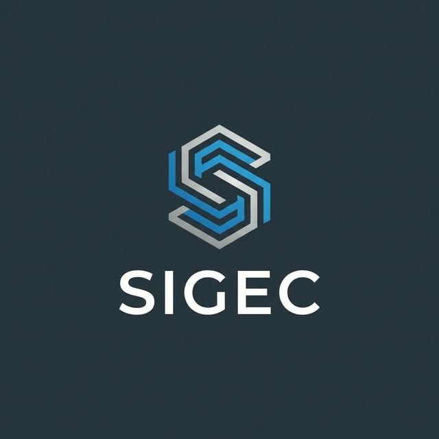

<p align="center"><a href="#"></a></p>

## Sobre Sigec

**Sigec** (Sistema de Gestión de Congresos) es una aplicación web desarrollada con Laravel para la gestión integral de congresos y eventos académicos.

### Características principales

- **Gestión de usuarios** - Sistema de autenticación con múltiples roles:
  - Administradores
  - Ponentes
  - Asistentes

- **Gestión de patrocinadores** - Registro y administración de sponsors del congreso con diferentes niveles (oro, plata, bronce, colaborador, institucional)

- **Categorías** - Organización del contenido científico por categorías temáticas

- **Ponencias** - Los ponentes pueden subir y gestionar sus presentaciones científicas (PDF, PowerPoint, Keynote, Open Document)

- **Pósters científicos** - Los ponentes pueden subir pósters científicos en formato PDF con opción de publicación

- **Portal público** - Visualización de pósters publicados con sistema de filtrado por título y categoría

## Requisitos

- PHP 8.2+
- Composer
- Laravel 12.x
- Base de datos MySQL/PostgreSQL/Sqlite

## Instalación

```bash
# Clonar el repositorio
git clone https://github.com/antonioverdugo/sigec.git
cd sigec

# Instalar dependencias
composer install
npm install

# Copiar archivo de configuración
cp .env.example .env

# Generar clave de aplicación
php artisan key:generate

# Ejecutar migraciones
php artisan migrate

# Iniciar el servidor
php artisan serve
```

## Estructura del proyecto

```
├── app/
│   ├── Http/
│   │   ├── Controllers/
│   │   │   ├── CategoryController.php
│   │   │   ├── DashboardController.php
│   │   │   ├── PosterController.php
│   │   │   ├── PresentationController.php
│   │   │   ├── ProfileController.php
│   │   │   └── SponsorController.php
│   │   └── Requests/
│   │       ├── Category/
│   │       ├── Poster/
│   │       ├── Presentation/
│   │       └── Sponsor/
│   └── Models/
│       ├── Category.php
│       ├── Poster.php
│       ├── Presentation.php
│       ├── Sponsor.php
│       ├── TypeSponsor.php
│       └── User.php
├── database/
│   ├── migrations/
│   └── seeders/
└── resources/
    └── views/
        └── dashboard/
```

## Tecnologías

- **Backend:** Laravel 12, PHP 8.2+
- **Frontend:** Blade Templates, Tailwind CSS
- **Base de datos:** MySQL/PostgreSQL/Sqlite con Eloquent ORM
- **Autenticación:** Laravel Breeze

## Licencia

Este proyecto es open-source bajo la [MIT license](https://opensource.org/licenses/MIT).
